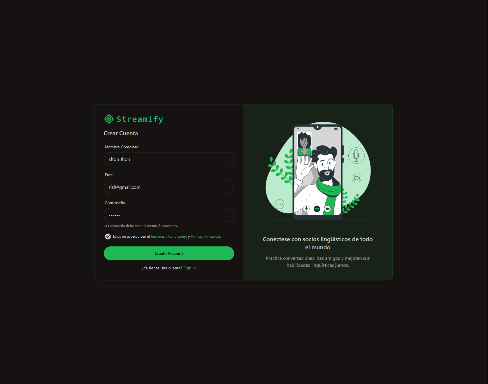
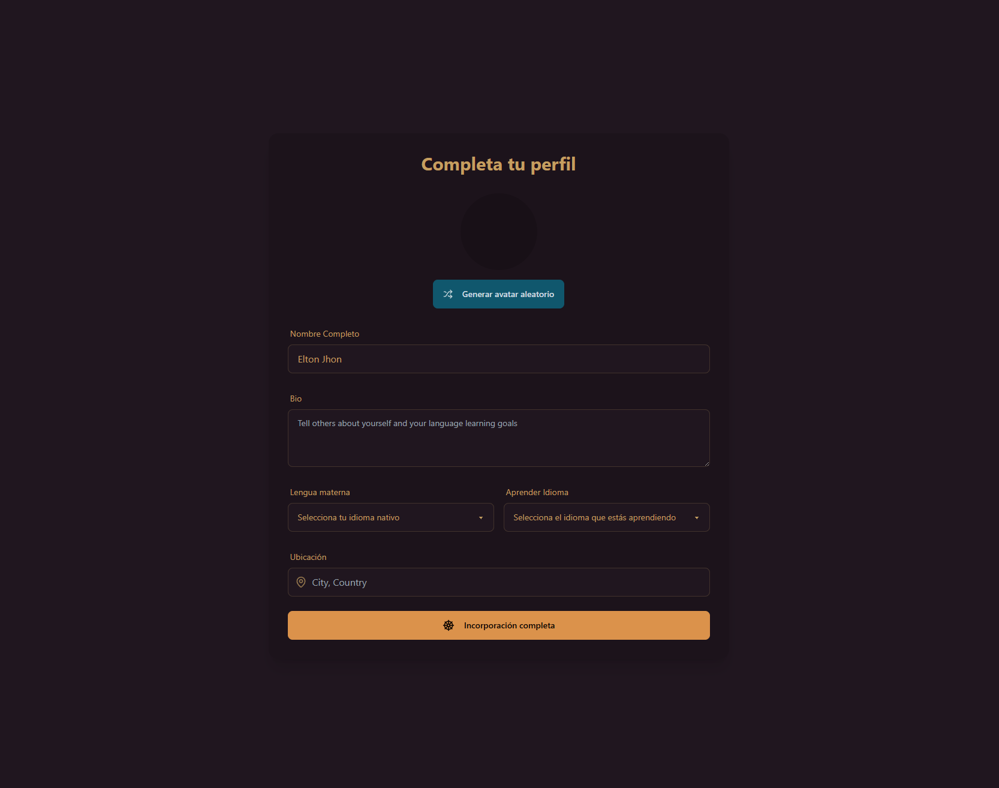
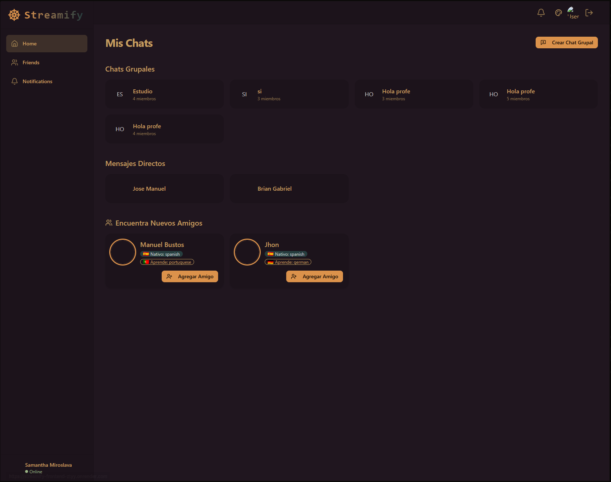
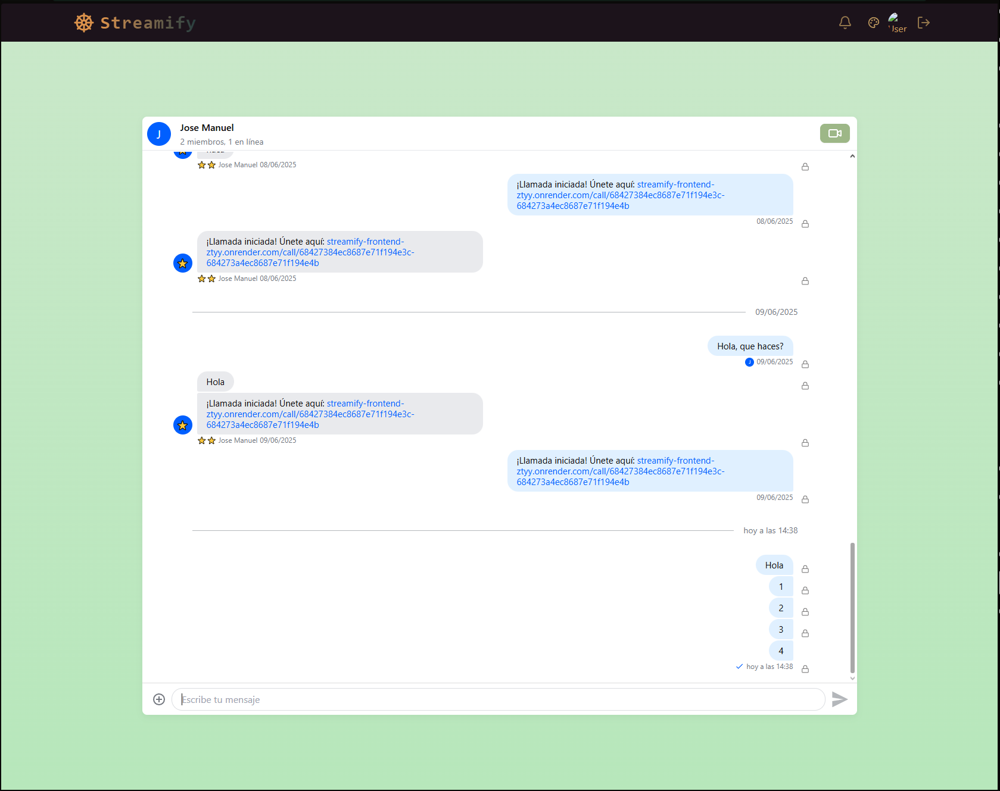
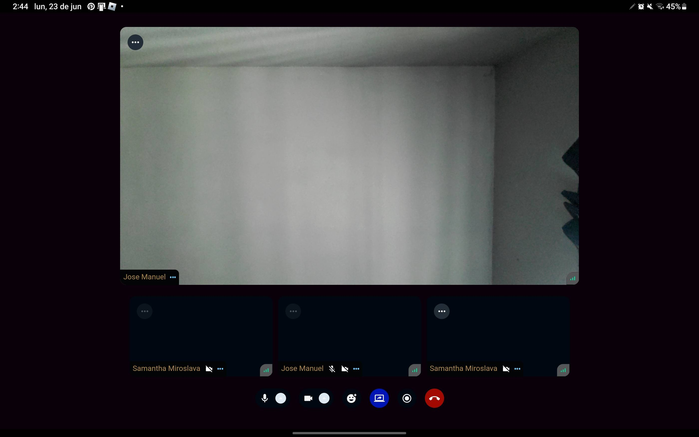
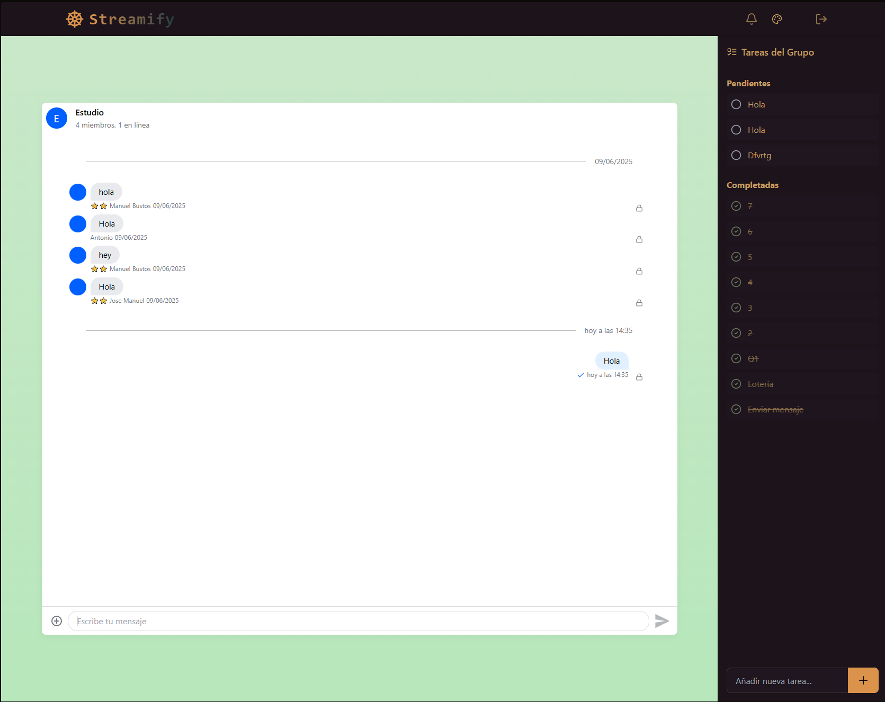
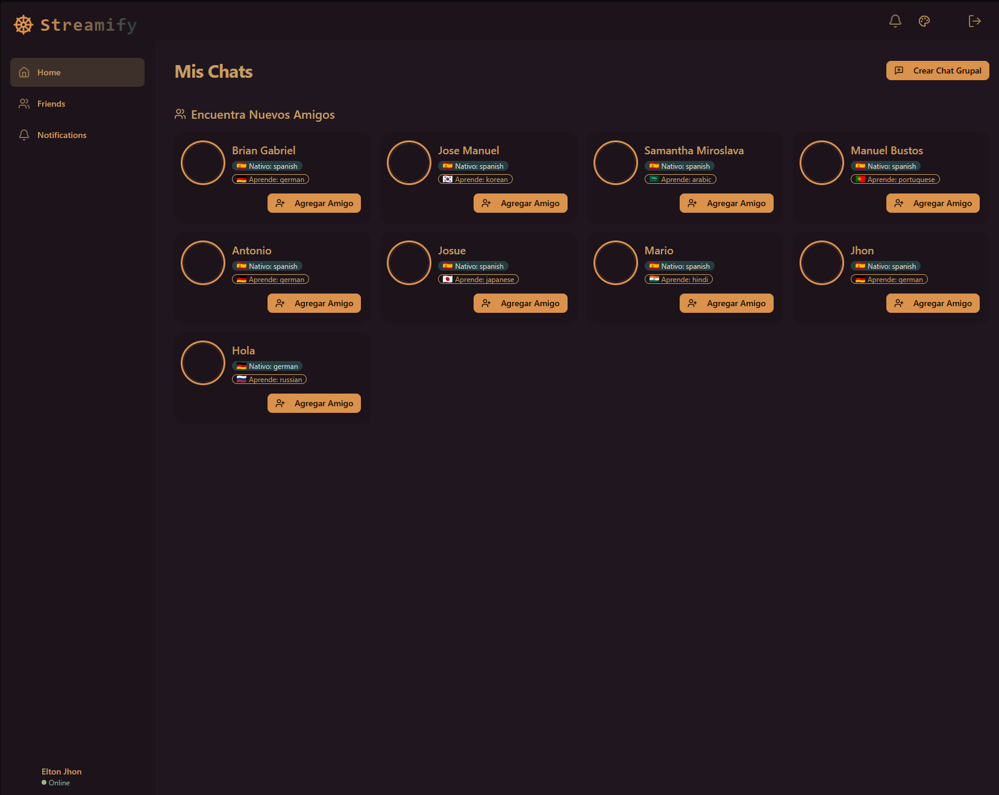

# 📩 MessageChat

Un proyecto de Programación Orientada a la Internet

**MessageChat** es una red social diseñada para mensajear y realizar llamadas con tus amigos. Puedes crear chats grupales, enviar mensajes desde cualquier lugar y mantenerte conectado fácilmente.

---

## 🌐 Descripción General

MessageChat permite crear un usuario ingresando tus datos básicos, los cuales se almacenan en una base de datos. Una vez registrado, puedes iniciar sesión, enviar solicitudes de amistad a otras personas de la plataforma y empezar a chatear.

### 👤 Registro e inicio de sesión

- Crea tu cuenta en segundos.
- Datos almacenados de forma segura en MongoDB.
- Inicia sesión desde cualquier dispositivo.

****  
**** 

---

### 🗨️ Funcionalidad de amigos y chats

- Envío y aceptación de solicitudes de amistad.
- Chats privados y grupales.
- Chats grupales requieren mínimo 3 personas para crearse.

**** 

---

### 📞 Llamadas privadas

- Llama a tus amigos en privado desde un chat 1 a 1.
- Funcionalidades dentro de la llamada:
  - Compartir pantalla
  - Activar cámara en tiempo real
  - Reaccionar con emojis
  - Charlar en voz

****  
**** 

---

### ✅ Sistema de tareas y recompensas ⭐

En los chats grupales puedes:

- Crear tareas y asignarlas.
- Todos los miembros del grupo pueden verlas.
- Completa tareas para ganar ⭐ estrellas.
- Las estrellas se otorgan con base en cantidad y nivel de dificultad.

****  
**** 

---

## 🚀 Demo en línea

La aplicación está desplegada en **Render** y puedes probarla aquí:

🔗 [https://streamify-frontend-ztyy.onrender.com](https://streamify-frontend-ztyy.onrender.com)

---

## 🛠️ Tecnologías utilizadas

- React.js (Frontend)
- Node.js / Express (Backend)
- MongoDB (Base de datos)
- WebRTC (llamadas en tiempo real)
- Socket.io (mensajería en tiempo real)
- Render (deploy del frontend y backend)

---
